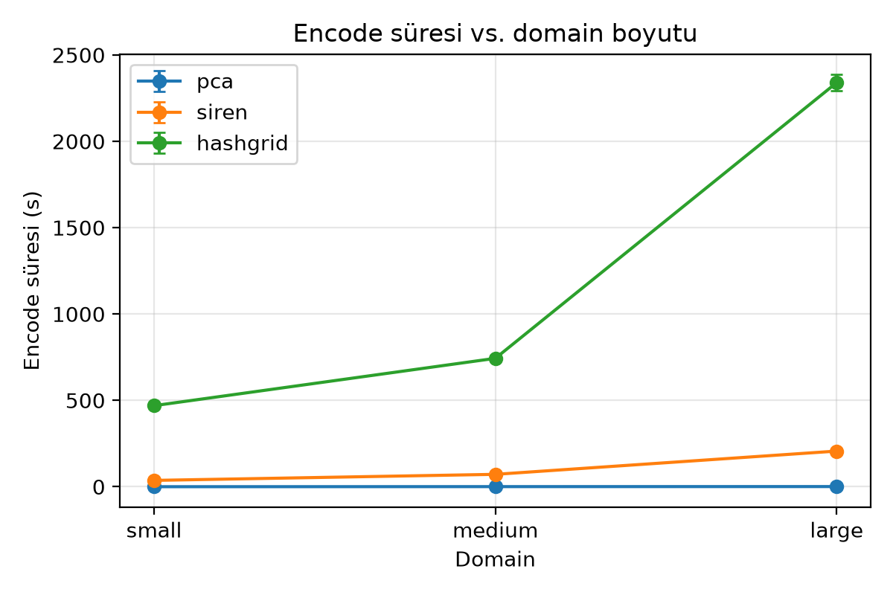
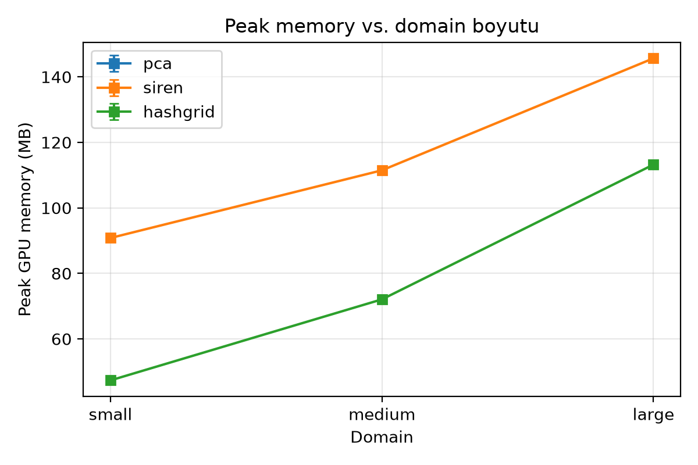
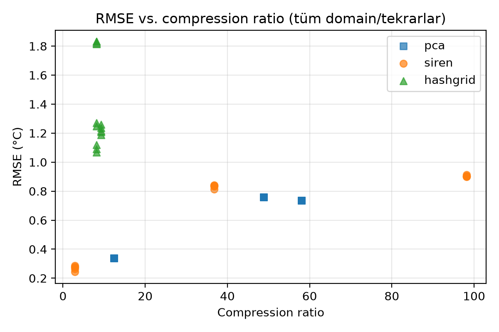

# Deney Sonuçları Raporu

Kaynak: `results/experiment_results.csv`
Toplam koşu sayısı: 45

## 1. HPC Metrikleri (BAŞARIM için)

| Domain | Yöntem | Encode (s) | Decode (s) | Peak Memory (MB) | Tekrar |
|---|---|---|---|---|---|
| small | pca | 0.006 ± 0.008 | 0.000 ± 0.000 | — | 5 |
| small | siren | 36.537 ± 1.165 | 0.005 ± 0.000 | 90.807 ± 0.000 | 5 |
| small | hashgrid | 469.348 ± 8.051 | 0.036 ± 0.001 | 47.341 ± 0.000 | 5 |
| medium | pca | 0.497 ± 0.114 | 0.098 ± 0.002 | — | 5 |
| medium | siren | 71.619 ± 7.164 | 0.056 ± 0.002 | 111.470 ± 0.263 | 5 |
| medium | hashgrid | 743.314 ± 15.494 | 0.452 ± 0.061 | 72.069 ± 0.000 | 5 |
| large | pca | 0.819 ± 0.093 | 0.153 ± 0.046 | — | 5 |
| large | siren | 206.232 ± 4.058 | 0.150 ± 0.001 | 145.650 ± 0.000 | 5 |
| large | hashgrid | 2339.206 ± 46.800 | 1.321 ± 0.015 | 113.204 ± 0.000 | 5 |

## 2. Representation Kalitesi (REO-2 için)

| Domain | Yöntem | Compression Ratio | RMSE (°C) | Tekrar |
|---|---|---|---|---|
| small | pca | 12.401 ± 0.000x | 0.339 ± 0.000 | 5 |
| small | siren | 2.920 ± 0.000x | 0.269 ± 0.017 | 5 |
| small | hashgrid | 8.157 ± 0.000x | 1.160 ± 0.093 | 5 |
| medium | pca | 48.846 ± 0.000x | 0.758 ± 0.000 | 5 |
| medium | siren | 36.736 ± 0.000x | 0.833 ± 0.011 | 5 |
| medium | hashgrid | 8.181 ± 0.000x | 1.823 ± 0.007 | 5 |
| large | pca | 58.067 ± 0.000x | 0.737 ± 0.000 | 5 |
| large | siren | 98.184 ± 0.000x | 0.904 ± 0.006 | 5 |
| large | hashgrid | 9.283 ± 0.000x | 1.222 ± 0.028 | 5 |

## 3. ClimateBenchPress Error-Bound Değerlendirmesi (Reichelt et al. 2026)

RMSE'nin ERA5'in kendi ensemble spread'inden türetilen fiziksel hata sınırlarına
göre değerlendirilmesi. "Geçti" oranı, o kombinasyonun tekrarlarından kaçının
ilgili sınırı sağladığını gösterir (örn. %100 = tüm tekrarlar geçti, %0 = hiçbiri geçmedi).

| Domain | Yöntem | b_low geçti | b_mid geçti | b_high geçti | MaxAbsError | Spectral Error |
|---|---|---|---|---|---|---|
| small | pca | 0% | 0% | 0% | 2.760 ± 0.000 | 871.872 ± 0.017 |
| small | siren | 0% | 0% | 0% | 2.119 ± 0.130 | 1151512.550 ± 169166.814 |
| small | hashgrid | 0% | 0% | 0% | 6.676 ± 0.763 | 9971052.700 ± 1940180.856 |
| medium | pca | 0% | 0% | 0% | 6.571 ± 0.000 | 1739529.800 ± 16.041 |
| medium | siren | 0% | 0% | 0% | 5.638 ± 0.347 | 755682483.200 ± 50128483.013 |
| medium | hashgrid | 0% | 0% | 0% | 13.269 ± 1.176 | 4500943974.400 ± 62558125.034 |
| large | pca | 0% | 0% | 0% | 8.089 ± 0.000 | 15035922.800 ± 99.588 |
| large | siren | 0% | 0% | 0% | 8.661 ± 0.325 | 3920161024.000 ± 104051580.040 |
| large | hashgrid | 0% | 0% | 0% | 9.635 ± 0.558 | 12872489574.400 ± 742524913.268 |

## 4. Scalability Özeti

Domain büyüdükçe encode süresinin kaç kat arttığı (strong/weak scaling
tartışmasında doğrudan kullanılabilir):

| Yöntem | small -> medium (encode süresi katı) | medium -> large (encode süresi katı) |
|---|---|---|
| pca | 77.28x | 1.65x |
| siren | 1.96x | 2.88x |
| hashgrid | 1.58x | 3.15x |

## 5. Ham Özet Tablosu

| domain   | method   |   encode_time_mean |   encode_time_std |   decode_time_mean |   decode_time_std |   peak_memory_mean |   peak_memory_std |   compression_ratio_mean |   compression_ratio_std |   rmse_mean |    rmse_std |   max_abs_error_mean |   max_abs_error_std |   spectral_error_mean |   spectral_error_std |   passes_b_low_rate |   passes_b_mid_rate |   passes_b_high_rate |   n_runs |
|:---------|:---------|-------------------:|------------------:|-------------------:|------------------:|-------------------:|------------------:|-------------------------:|------------------------:|------------:|------------:|---------------------:|--------------------:|----------------------:|---------------------:|--------------------:|--------------------:|---------------------:|---------:|
| small    | pca      |         0.00643186 |         0.0081235 |         0.00028307 |       1.53705e-05 |           nan      |        nan        |                 12.4012  |                       0 |    0.338933 | 1.3328e-08  |              2.7602  |         8.46571e-06 |         871.872       |          0.0173212   |                   0 |                   0 |                    0 |        5 |
| small    | siren    |        36.5371     |         1.16491   |         0.00478481 |       0.000458686 |            90.8066 |          0        |                  2.91977 |                       0 |    0.269434 | 0.016751    |              2.11872 |         0.13026     |           1.15151e+06 |     169167           |                   0 |                   0 |                    0 |        5 |
| small    | hashgrid |       469.348      |         8.0513    |         0.0357719  |       0.00141614  |            47.3413 |          0        |                  8.15698 |                       0 |    1.1596   | 0.0934229   |              6.67593 |         0.763012    |           9.97105e+06 |          1.94018e+06 |                   0 |                   0 |                    0 |        5 |
| medium   | pca      |         0.497061   |         0.113958  |         0.09797    |       0.00194182  |           nan      |        nan        |                 48.8458  |                       0 |    0.757932 | 6.52936e-08 |              6.57105 |         1.59238e-05 |           1.73953e+06 |         16.0411      |                   0 |                   0 |                    0 |        5 |
| medium   | siren    |        71.6188     |         7.164     |         0.055987   |       0.00246655  |           111.47   |          0.262694 |                 36.7357  |                       0 |    0.832726 | 0.0112871   |              5.63755 |         0.347072    |           7.55682e+08 |          5.01285e+07 |                   0 |                   0 |                    0 |        5 |
| medium   | hashgrid |       743.314      |        15.4936    |         0.451609   |       0.0614214   |            72.0693 |          0        |                  8.18138 |                       0 |    1.82307  | 0.00697207  |             13.2688  |         1.1756      |           4.50094e+09 |          6.25581e+07 |                   0 |                   0 |                    0 |        5 |
| large    | pca      |         0.819219   |         0.0930548 |         0.153113   |       0.0462459   |           nan      |        nan        |                 58.0672  |                       0 |    0.736997 | 1.14652e-07 |              8.08897 |         3.1916e-06  |           1.50359e+07 |         99.5876      |                   0 |                   0 |                    0 |        5 |
| large    | siren    |       206.232      |         4.05751   |         0.150394   |       0.00122326  |           145.65   |          0        |                 98.1844  |                       0 |    0.903647 | 0.00550863  |              8.66108 |         0.325188    |           3.92016e+09 |          1.04052e+08 |                   0 |                   0 |                    0 |        5 |
| large    | hashgrid |      2339.21       |        46.8       |         1.32143    |       0.0150824   |           113.204  |          0        |                  9.28326 |                       0 |    1.22198  | 0.0275746   |              9.63457 |         0.557599    |           1.28725e+10 |          7.42525e+08 |                   0 |                   0 |                    0 |        5 |
